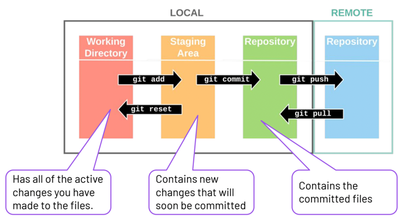
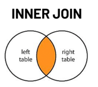
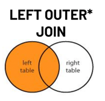
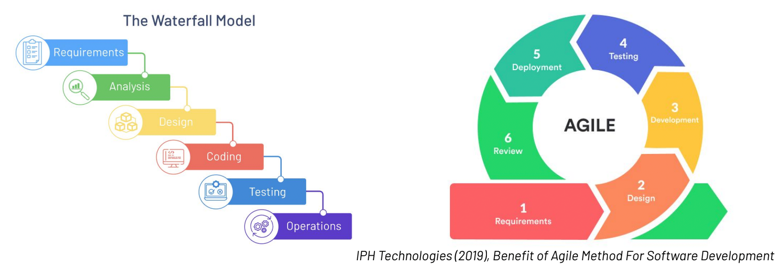

# Theory answers

This file contains all my answers to the theory portion of the exam.

Final mark: 100%

## Q1.1

(Explain the difference between a primary key and a foreign key:
2 marks)

### Primary key
In an SQL database table, the primary key is a special type of column that is used to uniquely identify each record in that table. 
They are set using the key word `PRIMARY KEY`.

Primary key values cannot be NULL and must be unique (i.e., can have no duplicate values across rows). Each table in a database 
can only have one primary key (but that primary key can be made up of multiple columns, known as a 'composite primary key').

Primary keys are used in 'parent' tables which can then be referenced by 'child' tables (using 'Foreign keys', see below).

### Foreign key
In contrast, a foreign key is used to create relationships between tables in a (relational) database, and unlike primary keys,
there can be multiple foreign keys within one table (e.g., employee_id might be a primary key in the employees table
and department_id might be a primary key in the departments table, but they could both appear in the same table as foreign keys).

The foreign key (in the 'child' table) references the primary key of another table (the 'parent' table). 
By including the foreign key, it creates a link between the 'parent' table and the 'child' table, and ensures "referential integrity"
(i.e., stops data inconsistencies across tables in a relational database).

Foreign keys can be set to NULL within the 'child' table.

### Key differences
- Their purpose: Primary keys are used to uniquely identify records in a table, Foreign keys are used to create links/relationships 
between tables and ensure referential integrity.
- There can only be ONE Primary key in a table, but there can be MULTIPLE Foreign keys in a table.
- Primary key values CANNOT be NULL, Foreign key values CAN be NULL.
- Primary key values in the 'parent' must be UNIQUE, Foreign key values in the 'child' table do not have to be unique.

## Q1.2

(What is the role of the `finally` block in Python exception handling and how would you use it: 2 marks)

### Role of `finally` block 
The `finally` block in exception handling ensures that regardless of whether the `try` block produces an exception, the code in the 
`finally` block will ALWAYS run.

### How you would use it
You use it when you want something to always happen in your program, regardless of whether a `try` is successful or
whether an exception occurs. 

So, for example, you might have some code that tries to execute an SQL query to retrieve some data from an SQL database. 
Regardless of whether an exception occurs in this process, you always want to make sure that the database is closed. 
This is where you would use a `finally` block.

To illustrate, the typical structure of exception handling is as follows:

```
try:
    'some code'
except:
    'if exception is raised, run this code'
else:
    'if code in 'try' works, run this code'
finally:
    'whatever happens following the try block, ALWAYS run this code'
```

So, for the example described above, here is a concrete example of code that would always close a database (from CFG assignment 4),
whether or not the query in the try block was successful or an exception occurs.

```
# try to execute SQL query
try:
    query = """
        SELECT  nailTech, `12-13`, `13-14`, `14-15`, `15-16`, `16-17`, `17-18`
        FROM nail_bookings 
        WHERE bookingDate = '{}'
        """.format(_date)

    cur.execute(query)  # Execute the SQL query
    result = cur.fetchall()  # Fetch all results from the executed query, which returns a list of tuples
    availability = _map_values(result)  # Map the raw results to a user-friendly format using helper function!
    cur.close()  # Close the cursor object

# If query isn't successful, this exception will be raised.
except Exception as e:
    raise DbQueryError(f"Query to database {db_name} failed. Make sure table and columns exist!") from e

# Use finally bloack to always closes the connection!
finally:
    db_connection.close()  # Close the database connection
    print("DB connection is closed")  # Print a message indicating the connection is closed
```

## Q1.3

(Explain the difference between a commit and a push in Git. 2 marks)

### Commit

As we make changes within a git repository, after 'adding' the changes (using `git add`) to the 'staging area',
we can add commits to keep track of our changes (orange to green in the figure below from CFG slides). 
Each commit is commonly described as a 'change point', 'save point' or 'snapshot'.



By committing changes to our repository's version history, we can then go back to different 'save points' if we need to and revert changes
back to that point (e.g., if we find a bug in our new code or maybe just preferred an earlier implementation of a feature / analysis following
feedback). 
It is best practice to always include a message when we commit to explain the changes we have made (otherwise, going back to specific
commits would be very difficult and collaborators will find it harder to understand the changes we have made).

For example, if you have added a new function to one of your scripts, you might run the following to commit the change with
an informative message:

```
git add utils.py
git commit -m "added new string validation function to utils.py."
```
This change will now be associated with a unique identifier, along with the commit message, in the repository's version history.

### Push

When you commit a change in a local repository, the commit will not appear in your remote repository until you 'push'
the commit, i.e., transfer the commit in your local repository to your remote repository (green to blue in figure above).
After you push, the commit will appear in the remote repository (e.g., on GitHub.com).

For example, continuing with the example above, you would run the following to push the commit to your remote main branch.

```
git push origin main
```

Note, as you work, you can make multiple commits before you push, and then push multiple commits at once.

E.g.,
```
git add utils.py
git commit -m "added new string validation function to utils.py."
git add utils.py
git commit -m "added extra argument to string validation function in utils.py."
git push origin main
```

### Summary of key differences
- commit RECORDS/SAVES CHANGES to the LOCAL repository (making a snapshot of current state of repository)
- push TRANSFERS THE COMMIT (or commits) to the REMOTE repository

Therefore, one is about tracking changes, the other is about sending them to the remote repository.

## Q1.4

(Provide examples of two web APIs and describe their functionalities. 4 marks)

### Web APIs
API stands for Application Programming Interface. They allow different applications to interact with each other. 
Therefore, a web API is an application programming interface for the web, and it is the most common type of API.

#### Example 1: Pokéapi (https://pokeapi.co/)

What it does: This API provides a programming interface that allows users to access a database of thousands of Pokémon-related objects.
It is open source (code available on GitHub) and it is a 'RESTful' API: RESTful APIs are a type of web API that use HTTP protocols (e.g., GET)
to access and retrieve data (reference: www.techtarget.com).

Cost and access: This API is free and does not require any authentication (i.e., no API key).

HTTP methods: This is a "consumption-only API" which means that only the HTTP 'GET' method is available (GET is used to request data
from server).

Requests return: data in json format.

Example use: You can use the API to get information on things like Moves, Abilities and Pokémons. For example, each 
Pokémon is associated with a unique identifier, and you can get info about the pokemons via a HTTP GET request to the following 
end point URL: https://pokeapi.co/api/v2/pokemon/{pokemon_number}/

e.g., This program (adapted from CFG session) uses the API to get data (name, height, and weight) about the pokemon associated with the ID provided 
by the user!

```
import requests

pokemon_num = input("What is the Pokemon's ID? ")

url = 'https://pokeapi.co/api/v2/pokemon/{}/'.format(pokemon_num)
response = requests.get(url)
pokemon = response.json()
print(pokemon['name'])
print(pokemon['height'])
print(pokemon['weight'])
```

#### Example 2: Open Notify (http://open-notify.org/)

What it does: Open Notify provides a simple programming interface for some of NASA’s data (location of space station
and number of people in space).

Cost and access: This API is also free and does not require any authentication.

Requests return: data in json format.

For example, one thing you can do using Open Notify is (1) Return the current location of the internation space station.

End point URL = http://api.open-notify.org/iss-now.json

HTTP end point:
- Uses GET HTTP method to retrieve data, and takes no inputs.

What it returns:
- It returns the latitude and longitude with a time stamp for the time the location was valid.

A request to the API returns the following data in json format:

```
{
  "message": "success", 
  "timestamp": UNIX_TIME_STAMP, 
  "iss_position": {
    "latitude": CURRENT_LATITUDE, 
    "longitude": CURRENT_LONGITUDE
  }
}
```

You can also use it to (2) Return how many people are currently in space.

End point URL = http://api.open-notify.org/astros.json

- Also uses GET HTTP method to retrieve data, and takes no inputs.
- It returns the number of people, as well as the name of the people and the aircraft they are on.

A request to the API returns the following:

```
{
  "message": "success",
  "number": NUMBER_OF_PEOPLE_IN_SPACE,
  "people": [
    {"name": NAME, "craft": SPACECRAFT_NAME},
    ...
  ]
}
```

For example, if you wanted to find out the number of people in space currently, who they are, and what air craft they 
are on, you could run the following (adapted from CFG sessions):

```
import requests

endpoint = 'http://api.open-notify.org/astros.json'
response = requests.get(endpoint) # making a call to the API
print(response.status_code)  # print status code (want it to be 200)
data = response.json()  # get data
pp(data) # pretty print all the data
pp(data['number']) # pretty print the number of people

# Could loop over people, and print out their name and the air craft they are on!
for item in data['people']:
    print (item['name'], item['craft']) 
```

## Q1.5

(Describe four tasks in the role of the Product Owner in Agile development 4 marks)

### Product owner roles and responsibilities
The product owner is responsible for the "product vision". To do this, they work closely with stakeholders to develop the product vision
and then communicate that vision to the scrum team (and other stakeholders).

Compared to developers, their main focus should be on the "what", not the "how". This means they are responsible for making sure that a 
product has a set of features, not exactly how the features are implemented (reference: www.mountaingoatsoftware.com).
e.g., they would be responsible for ensuring the product has a "check user exists in database" feature, but would then leave
it up to the developer team to decide exactly how that was implemented.

### Tasks in the role of product owner
Key tasks include:

1. Develop product vision in collaboration with stakeholders and communicate the product vision effectively to scrum team.
2. Creating and updating the product backlog (list of product features and requirements that is always changing, ordered by priority). 
They must ensure that the backlog reflects the **current** product vision, in response to changes in requirements 
(e.g., changes in market competition and needs).
3. Ordering and prioritising the backlog; they should look ahead to future sprints to make sure that product backlog items 
are ordered and lined up effectively for future sprints (i.e., sprint planning).
4. Create (and adjust) product "roadmap"; they should work with developers and stakeholders to create a roadmap that outlines
what will be delivered and when. This roadmap changes as requirements evolve.
5. They would attend sprint planning (determining what should be worked on), sprint reviews (where they interface between developers & stakeholders
and accept/reject work the development team has done depending on whether it satisfies product requirements), and sprint retrospectives 
(to understand any issues that have come up and how much the developers understand the product, and it's vision).
6. Writing user stories to ensure that the product has features that are aligned with the customer / end user needs.

## Q1.6

(Name two types of SQL joins and provide an example scenario for each.
4 marks)

### Types of join
There are 4 main types of SQL join: inner join, full outer join, left outer join, and right outer join. I will focus on
(1) inner join and (2) left outer join.

#### Inner join explanation

Inner joins result in the intersection (see figure below from CFG slides) of two tables (i.e., returns common rows only).

Therefore, you want to use inner join when you want results that have matching values in both tables, and don't want
to retain rows where there is missing data in either table.



#### Inner join example scenario

I am an editor of an academic journal and want to contact all first-authors of neuroscience papers in my journal for 2024 
to invite them to contribute to a special edition I am planning. I can only contact authors for whom we have an email address for.

Neuroscience database.
Two tables: 'authors' and 'papers'
- 'authors' has 'author_ID', 'author_name' and 'author_email' of different authors of neuroscience papers.
- 'papers' has information about different academic papers, including their titles, publication date and 
the author IDs of the first-authors.

Inner join can be used to return a list of neuroscience papers published in 2024 with the name and email address of the 
first-authors that wrote them, where an email address exists, so that I can contact them.

e.g., 
```
SELECT a.author_name, a.author_email, p.paper_title
FROM authors a
INNER JOIN papers p
ON a.author_id = p.author_id
WHERE YEAR(p.date)= 2024;
```

#### Left outer join explanation

In a left outer join, all rows from the left side (see figure below from CFG slides), along with the matching rows from the right side, 
will be returned. So, if they are no matches in the right table, it returns all the rows from the left side but the columns 
from the right will be NULL.



#### Left outer join example scenario
I am planning a social function for the staff at my workplace. I need a list of all staff and their dietary requirements.

Staff database:
Two tables: 'staff' and 'requirements'
- 'staff' has staff IDs and staff names
- 'requirements' has staff IDs and any food requirements they have, if any.

I want to use a left outer join in this example because I want to make sure I have a list of ALL staff, regardless of whether
they have a dietary requirement, but I want to know what the requirements are if there are any.

```
SELECT s.name, r.dietary
FROM staff s
LEFT JOIN requirements r
ON e.staff_id = r.staff_id;
```

## Q1.7

(Explain the difference between mutable and immutable data types in Python, provide an example of each.
4 marks)

### The difference

Mutable data types are data types whose values CAN be changed in place (i.e., without changing the objects 'identity'), 
whereas immutable data types are data types whose values CANNOT be changed in place.

This means you cannot change the state of immutable objects after creation, whereas you can change the state of mutable
objects after creation.

### Examples of each

Most built-in data types in Python are immutable.
Examples of immutable data types: integers, floats, booleans, strings, tuples
- you cannot change the value of these types; you just have to create a new object with a new value.

Examples of mutable data types: lists, dictionaries, sets

### Concrete illustration to show difference

(reference: https://realpython.com/)

Illustration of mutable vs immutable data types by comparing behaviour of lists and tuples:
```
number_list = [1,2,3] # mutable
number_tuple = (1, 2, 3) # immutable
```

With a mutable list, you can do this to change the first number in the list from 1 to 100:
```
number_list[0] = 48
```

However, with an immutable tuple, you cannot do this (it would throw a type error).
```
number_tuple[0] = 48
```

## Q1.8

(Explain both Agile and Waterfall approaches to Software Development, and at least 2 differences between them
4 marks)

### Waterfall
Waterfall methodology is a **linear** project management approach (as demonstrated in the left-hand side of figure below from CFG slides).

In this methodology, requirements are gathered at the start of the project, and then a linear, sequential plan is created 
to address those requirements in turn, i.e., each phase of the project 'cascades' into the next and this is why it's called
the 'waterfall' methodology.

Each stage of the 'waterfall' has set and fixed criteria for what should be completed in that phase and the next phase depends on 
the completion of the current phase (this is what makes it linear). E.g., in the figure below, all coding must be finished before testing begins.

You might choose a waterfall approach when the project has a strict set of requirements, or when 
stakeholders and/or managers are only involved at the beginning (requirements stage) and end (evaluation stage).
i.e., it is best suited to projects where the requirements are likely to be fixed and not change as project progresses.



### Agile
In contrast, Agile methodology is a **fluid** form of project management (see right-hand side of figure above).
It encourages and emphasises iterative, continuous and rapid development and improvement.

It emphasises flexibility over linearity. It focuses on small, iterative releases and each phase adapts to changes throughout
the development life cycle (reference: www.forecast.app).

The methodology is built upon the Agile manifesto, created by software developers in 2001, that aimed to promote a more 
flexible, collaborative, and customer-centric approach to software development.

Although agile methodology is a set of values, rather than a specific set of rules, several frameworks have been built 
based on the values and principles of Agile (which do have their own rules, e.g., Scrum). These frameworks help guide 
developers to work using the agile methodology.

You might choose an agile approach when requirements are likely to change as the project goes on, or when you want to 
"fail fast". For example, teams competing in the generative AI space currently would want to use an agile approach to 
respond to their competitors developments.

### Key Differences.
- Waterfall emphasises linearity, while agile emphasises fluidity and circularity.
- In waterfall, each phase must be completed before moving to the next, whereas Agile does not impose this constraint.
- In Waterfall, requirements are only set at the start of the project, whereas in Agile, requirements are reviewed continuously.
- You would use waterfall when requirements are strict and unlikely to change, and agile when requirements are fluid 
and likely to change.